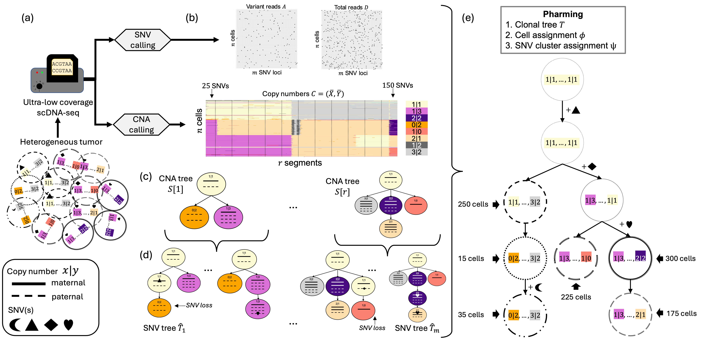
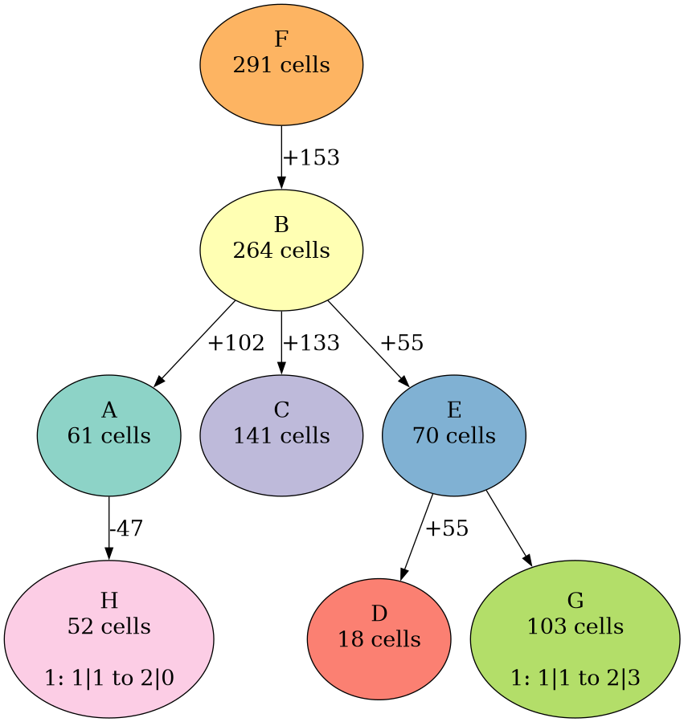

# Pharming
Solves the joint clonal tree inference problem and infers a joint CNA and SNV tree from low pass single-cell DNA sequencing.




## Dependencies
- `networkx`
- `pandas`
- `numpy`
- `scipy`
- `pybind11`
- `pyomo`
- `glpk`
- `lemon`
- `boost-cpp`


## Installation from github
The following installation steps will install a `pharming` module and CLI tools.

First, recursive clone the repo.
```
git clone git@github.com:elkebir-group/Pharming.git --recursive
cd Pharming
```

Next, create a new conda environment.
```
conda create -n pharming
conda activate pharming
```

Next, install all dependencies via conda-forge.
```
conda install python=3.9 lemon glpk pyomo pygraphviz boost-cpp  -c conda-forge -y
```

Finally, install both the `pharming` module and CLI tools.
```
pip install .
```


To check that all module and CLI tools installed correctly, run the following checks:
```
python -c "import pharming"
pharming --help
pharming-data --help
```

## Input
Pharming requires two input files:
1. alternate and total read counts for each SNV --- see [example/read_counts.tsv](example/read_counts.tsv) for an example. Note the names of the columns are not important but the order of the columns must match the example. 
2. allele-specific copy number profiles  --- see [example/copy_numbers.csv](example/copy_numbers.csv) for an example. Note the names of the columns are not important but the order of the columns must match the example. 

## Output
Pharming has two main outputs:  
1. A pickled `Solution` object containing the clonal tree, cost and cell assignment. The `Solution` object also has functions for analyzing and visualizing the output ---see [tutorial.ipynb](tutorial.ipynb) to see examples of how to interact with the solution object.
2. A streamlined visualization of output clonal tree --- see [example/tree0.png] to see the number of introduced SNVs or lost SNVs on each edge, the copy number state changes for each segment and the number of cells assigned to each clone.

3. The flat files containing the 
  - cell assignment (`example/output/pred_cell.csv`), with columns `cell,cluster`
  - SNV clustering (`example/output/pred_mut.csv`),  with columnes `mutation,cluster`
  - lost SNVs on each edge (`example/output/pred_mut_loss.csv`), with columnes `mutation,cluster`
  - genotypes of each clone and SNV (`example/output/pred_genotype.csv`) wiht columns `node,snv,x,y,xbar,ybar,segment`
  - pngs of the top n clonal trees (`example/output/ct0.png`)


## Usage
Pharming contains two CLI tools:  
- [`pharming-data`](#pharming-data-tool)
- [`pharming`](#pharming-tool)


### pharming-data tool
The `pharming-data` tool creates a reausable Pharming data object that can be used with `pharming` module to compute performance metrics and create visualizations. However, this step is not a required step and the `pharming` tool can be run directly from the input files listed above. 

```
$ pharming-data --help
usage: pharming-data [-h] -f FILE [-c PROFILES] [-m MUT_LOOKUP] [-l CELL_LOOKUP] [-s SEGMENT_LOOKUP] [-a ALPHA] [-D DATA]

optional arguments:
  -h, --help            show this help message and exit
  -f FILE, --file FILE  input file for variant and total read counts with unlabeled columns: [chr segment snv cell var total]
  -c PROFILES, --profiles PROFILES
                        filename of input copy number profiles
  -m MUT_LOOKUP, --mut-lookup MUT_LOOKUP
                        filename of mutation label to export
  -l CELL_LOOKUP, --cell-lookup CELL_LOOKUP
                        filename of cell label to export
  -s SEGMENT_LOOKUP, --segment-lookup SEGMENT_LOOKUP
                        filename of segment label to export
  -a ALPHA, --alpha ALPHA
                        sequencing error rate
  -D DATA, --data DATA  filename of pickled data object
```

#### Example
The tool takes in the example [read counts](example/read_counts.tsv) and [allele-specific copy number profiles ](example/copy_numbers.csv) and outputs a resuable Pharming data object (`example/data.pkl`). 
```
pharming-data -f example/read_counts.tsv -c example/copy_numbers.csv -a 0.001 -D example/data.pkl
```

### pharming tool
The `pharming` tool generatees the specified [output](#output) from the [input files](#input) listed above or optional a pickled data object generated by `pharming-data`, 

```
$ pharming --help
usage: pharming [-h] [-d DATA] [-f FILE] [-c COPY_NUMBERS] [-s SEED] [-j CORES] [-l LAMB] [-n TOP_N] [-T TM] [-k SNV_CLUSTERS]
                [-D DCFS] [--delta DELTA [DELTA ...]] [--ninit-segs NINIT_SEGS] [--ninit-tm NINIT_TM] [--thresh-prop THRESH_PROP]
                [--order {random,weighted-random,nsnvs,in-place,cost}] [--root_x ROOT_X] [--root_y ROOT_Y] [--collapse]
                [--sum-condition] [--cell-threshold CELL_THRESHOLD] [-L SEGMENTS [SEGMENTS ...]]
                [--excl-segments EXCL_SEGMENTS [EXCL_SEGMENTS ...]] [--segfile SEGFILE] [-P PICKLE] [-O OUT] [--all-sol ALL_SOL]
                [--model-selection MODEL_SELECTION] [--tree TREE] [--labels LABELS]

optional arguments:
  -h, --help            show this help message and exit
  -d DATA, --data DATA  input file of preprocessed data pickle
  -f FILE, --file FILE  input file for variant and total read counts with unlabled columns: [chr segment snv cell var total]
  -c COPY_NUMBERS, --copy-numbers COPY_NUMBERS
                        input files of copy numbers by segment with unlabeled columns [segment cell totalCN]
  -s SEED, --seed SEED  random number seed (default: 1026)
  -j CORES, --cores CORES
                        Max number of cores to use for inferring segment trees
  -l LAMB, --lamb LAMB  lambda value, default=1e3
  -n TOP_N, --top_n TOP_N
                        number of trees to retain in each step
  -T TM, --Tm TM        optional filename of mutation cluster tree
  -k SNV_CLUSTERS, --snv-clusters SNV_CLUSTERS
                        number of SNV clusters, if dcfs are also specified, k defaults to the number of specified DCFs
  -D DCFS, --dcfs DCFS  optional filename of dcfs to use
  --delta DELTA [DELTA ...]
                        list of DCFs to use, ignored if dcf file is provided
  --ninit-segs NINIT_SEGS
                        number of segments for initialization of mutation cluster tree
  --ninit-tm NINIT_TM   number of mutation cluster trees to consider after pruning with initial segs
  --thresh-prop THRESH_PROP
                        proportion threshold for determining CN states
  --order {random,weighted-random,nsnvs,in-place,cost}
                        ordering strategy for progressive integration, choose one of 'random', 'weighted-random', 'nsnvs', 'in-
                        place'
  --root_x ROOT_X       starting state for maternal (x) allele
  --root_y ROOT_Y       starting state for paternal (y) allele
  --collapse            whether linear chains of copy number events should be collapsed prior to integration
  --sum-condition       use the sum condition to filter mutation cluster trees
  --cell-threshold CELL_THRESHOLD
                        if collapsing is used, the minimum number of cells a CNA only clone requires to avoid collapsing, NA if not
                        collapsing.
  -L SEGMENTS [SEGMENTS ...], --segments SEGMENTS [SEGMENTS ...]
                        segment ids of trees to build
  --excl-segments EXCL_SEGMENTS [EXCL_SEGMENTS ...]
                        segment ids to exclude
  --segfile SEGFILE     filename with list of segments
  -P PICKLE, --pickle PICKLE
                        directory where the pickled solution list of top n trees should be saved
  -O OUT, --out OUT     directory where output files should be written
  --all-sol ALL_SOL     filename of object to pickle all top clonal trees inferred from each mutation cluster tree
  --model-selection MODEL_SELECTION
                        filename to write model selection information
  --tree TREE           filename to draw a pretty clonal tree
  --labels LABELS       filename to save the encoding for the labels of the pretty tree.

```

#### Example
This is an example of how to use the pharming CLI tool. The input may either be the input files or the resuable data object created with the 
`pharming-data` tool.  Pharming may be run on a subset of segments using `-L` argument followed by a space separated list of segment ids.

```
pharming -d example/data.pkl -s 11 -l 1000 -n 3 --dcfs example/dcfs.txt  \
 --sum-condition --collapse --cell-threshold 20 \
 -O example/output \
 -L 1 10  -P example/solutions.pkl --tree example/tree.png --labels  example/labels.csv
```

`--sum-condition` will utilize the DCFs to prune SNV cluster trees that violate the sum condition. `--collapse` is 
flag that can be used to speed up inference by collapsing linear chains in intermediate clonal trees that have fewer than
`--cell-threshold` assigned cells. 

To run `Pharming` from the raw files, use the following command:
```
pharming -f example/read_counts.tsv -c example/copy_numbers.csv \
 -s 11 -l 1000 -n 3 --dcfs example/dcfs.txt  \
 --sum-condition --collapse --cell-threshold 20 \
 -L 1 10   -P example/solutions.pkl \
 -O example/output \
 --tree example/tree.png --labels example/labels.csv
```

### pharming module
Pharming can also be imported a python module. See [tutorial.ipynb](tutorial.ipynb) for more details.
```
from pharming.pharming import Pharming
import pandas as pd
dat  = pd.read_pickle("example/data.pkl")
dcfs = {}
with open("example/dcfs.txt", "r+") as file:
  for i, line in enumerate(file):
    dcfs[i] = float(line.strip()) 
ph = Pharming(dcfs=dcfs, seed=11, top_n=5,
  collapse=True,
  cell_threshold=10,
  sum_condition=True)
best_trees = ph.fit(dat, lamb=1000, segments=[1,10,14])
best_trees[0].write_flat_files('example/output')
```

**Full documentation and API for the pharming module coming soon!**